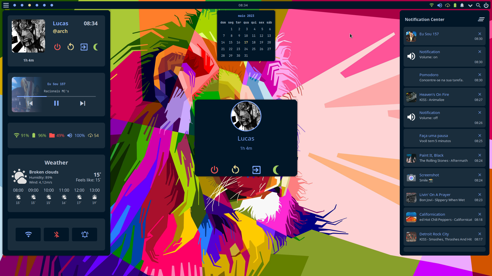

# AwesomeWM

## Features

- Dashboard Panel
- Notification Center Panel
- Power Menu Panel
- Calendar Panel
- Layout Switcher
- Right Click Menu
- Custom Notifications
  - Updates
  - Screenshot
  - Volume
  - Brightness

## Themes

This config has the following themes available:

- [Dracula](https://github.com/dracula/dracula-theme)
- [Lunar](https://github.com/LunarVim/lunar.nvim)
- [Moonfly](https://github.com/bluz71/vim-moonfly-colors)
- [Nightfly](https://github.com/bluz71/vim-nightfly-colors)

## AwesomeWM Modules

- **[bling](https://github.com/blingcorp/bling)**
    - Used for the Music Widget in the Dashboard Panel
