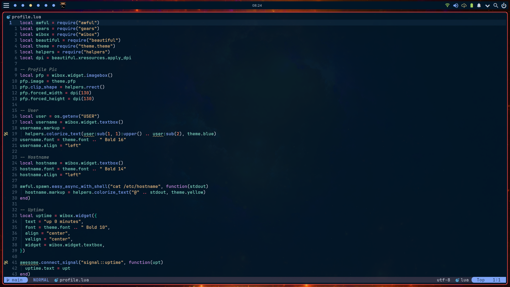

# Neovim

## Core Plugins

- [alpha](https://github.com/goolord/alpha-nvim)
- [bufferline](https://github.com/akinsho/bufferline.nvim)
- [cmp](https://github.com/hrsh7th/nvim-cmp)
- [lazy](https://github.com/folke/lazy.nvim)
- [lualine](https://github.com/nvim-lualine/lualine.nvim)
- [mason](https://github.com/williamboman/mason.nvim)
- [null-ls](https://github.com/jose-elias-alvarez/null-ls.nvim)
- [telescope](https://github.com/nvim-telescope/telescope.nvim)
- [todo-comments](https://github.com/folke/todo-comments.nvim)
- [toggleterm](https://github.com/akinsho/toggleterm.nvim)
- [treesitter](https://github.com/nvim-treesitter/nvim-treesitter)
- [which-key](https://github.com/folke/which-key.nvim)

## Colorschemes

This config has the following colorschemes available:

- [Dracula](https://github.com/dracula/dracula-theme)
- [Lunar](https://github.com/LunarVim/lunar.nvim)
- [Moonfly](https://github.com/bluz71/vim-moonfly-colors)
- [Nightfly](https://github.com/bluz71/vim-nightfly-colors)
